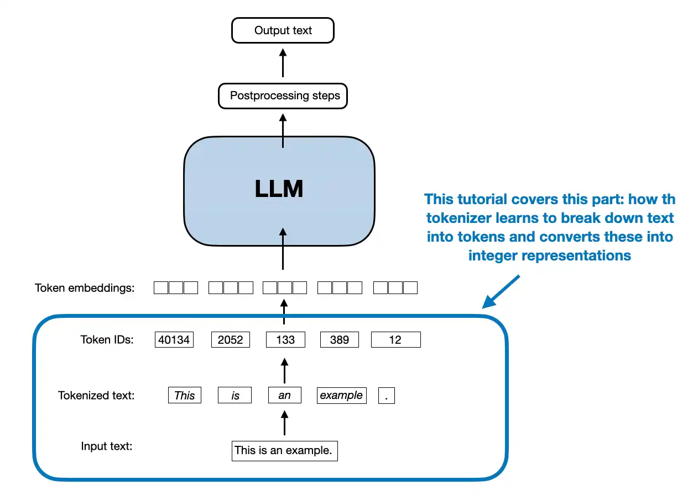
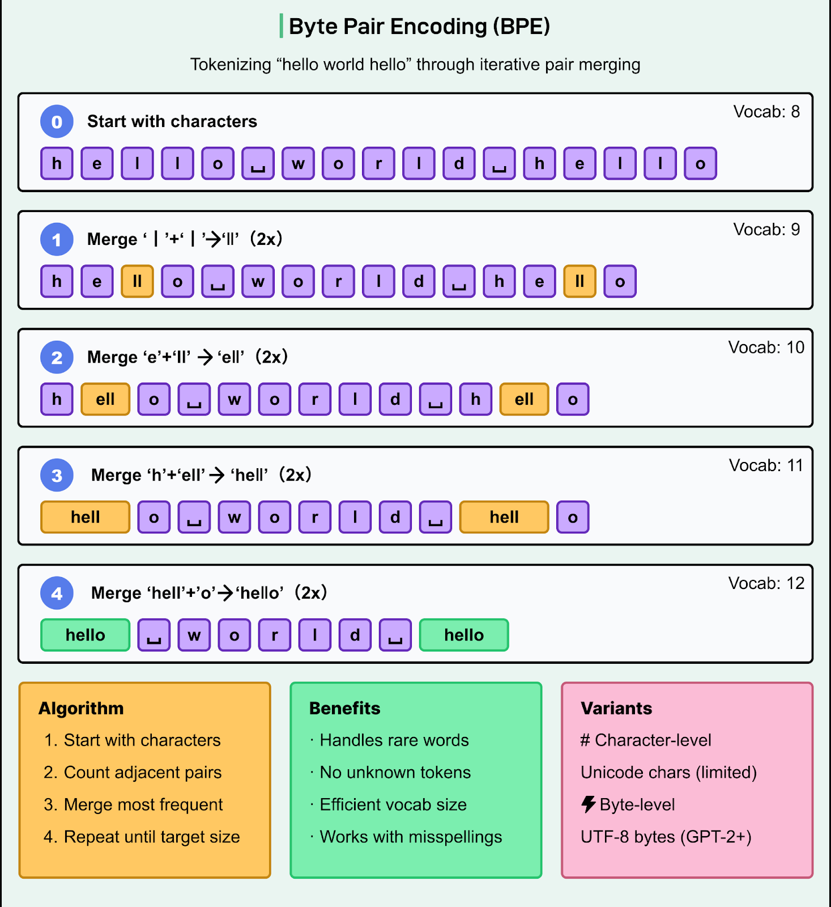

# Byte Pair Encoding (BPE) Lecture Summary

## Introduction to BPE
Notes covers Byte Pair Encoding (BPE), a subword tokenization method used in LLMs like GPT-2 and GPT-3. It builds on simple word-based tokenization and explains why BPE is superior for handling real-world text. BPE compresses data by merging frequent byte pairs, adapted for tokenization to create efficient vocabularies.

**School Example**: Think of BPE like grouping common letter pairs in kids' books, e.g., "th" in "the" and "that" becomes one unit to save space.

**Advanced Example**: In GPT-2, BPE yields ~50,257 tokens, far smaller than English's 170k words, enabling scalable training.

## Tokenization Types
Three main types exist: word-based, character-based, and subword-based (like BPE). Word-based treats each word as a token but struggles with out-of-vocabulary (OOV) words. Character-based uses tiny vocabularies (~256 for English) but loses word meanings and creates long sequences. Subword balances both by keeping common words intact while splitting rare ones.

| Type | Vocab Size | OOV Handling | Sequence Length | Meaning Capture |
|------|------------|--------------|-----------------|-----------------|
| Word | Large (170k+) | Poor | Short | Good for full words |
| Character | Small (~256) | Excellent | Long | Poor |
| Subword (BPE) | Medium (~50k) | Good | Medium | Good for roots/suffixes |

**School Example**: Word: "cat" → one token. Character: c-a-t → three tokens. Subword: "un" + "cat" for "uncat".

**Advanced Example**: "tokenization" and "modernization" share "ization" subword, helping models learn suffixes statistically.

## BPE History and Basics
Introduced in 1994 for data compression, BPE replaces frequent consecutive byte pairs (e.g., "aa") with new symbols iteratively. For LLMs, it's tweaked: start with characters, merge frequent pairs into subwords based on corpus frequency, add end-of-word markers (e.g., `</w>`). Stop at desired vocab size.

**School Example**: Compress "aaabdaabac": Merge "aa" → Z (ZabdaZbac), then "ab" → Y (ZYdZYac).

**Advanced Example**: Preprocess words like "old</w>", compute pair frequencies, merge top pairs repeatedly.

## BPE Training Process
1. Split corpus words into characters + `</w>`.
2. Build frequency table of pairs.
3. Merge most frequent pair into new token, update frequencies.
4. Repeat until vocab reaches target (e.g., 50k merges).

Example corpus: "old" (7x), "older" (3x), "finest" (9x), "lowest" (4x). Merges yield subwords like "old", "est</w>"; rare parts stay split.

**School Example**: Frequent "es" + "t" → "est"; "old" stays whole.

**Advanced Example**: Iteration 1: "e"+"s" (13x) → "es". Iteration 2: "es"+"t" → "est". Continues for "est</w>", "ol", "old".

## BPE Advantages
- Handles OOV by falling back to subwords/characters.
- Captures roots (e.g., "boy" in "boys") and affixes (e.g., "ization").
- Manages vocab size efficiently vs. word-level.

Drawbacks minimized compared to alternatives.

**School Example**: Unknown "fooball" → "foo" + "b" + "all" if subwords match.

**Advanced Example**: Reduces vocab from 170k to 50k, preserving semantics for transformer efficiency.

## Practical Implementation
Uses `tiktoken` library: `tokenizer = tiktoken.get_encoding("gpt2")`. Encode: text → token IDs. Decode: IDs → text. Handles unknowns seamlessly, e.g., "some unknown place" breaks into subwords.

**School Example**: `tokenizer.encode("hello")` → [15496, 995, 40]; decode reverses it.

**Advanced Example**: Vocab size 50257; `<|endoftext|>` is 50256. Test: Random "akwirwier" encodes without error.

## Next Steps
Upcoming: Data sampling, batching, context length before embeddings. Experiment with tiktoken on unknown text.

**School Example**: Try encoding story sentences.

**Advanced Example**: Integrate into LLM pipeline post-tokenization.

Ref:
1. https://vizuara.substack.com/p/understanding-byte-pair-encoding

---
    

--- 
 

---

 

 

